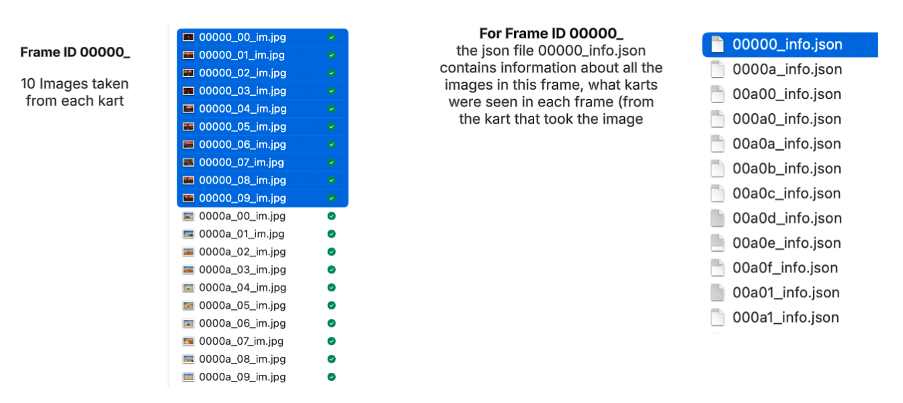
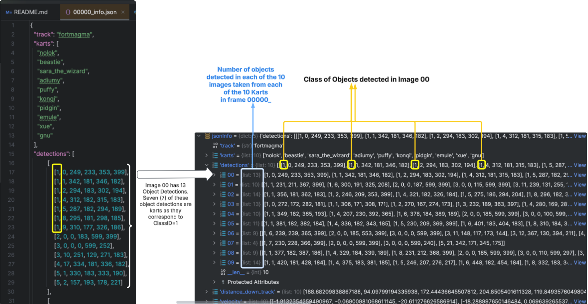
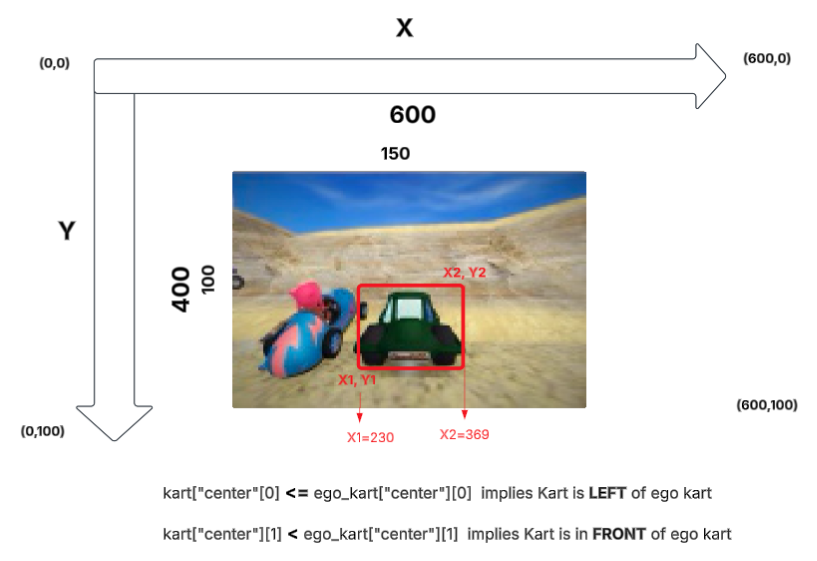
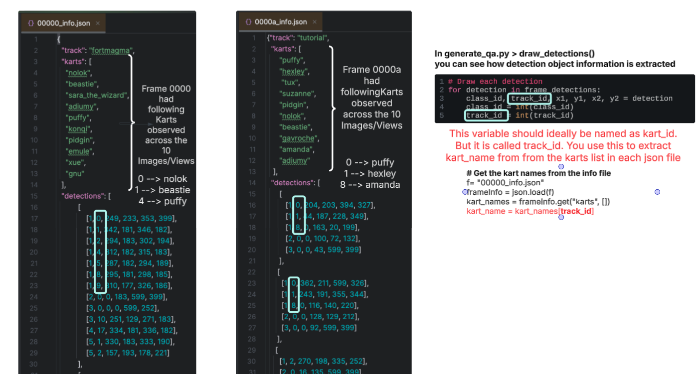

# HW4 Data 
 Data folder will have train and valid subfolders. Train sub-folder will have 52,500 images and 5,250 json files. Each json file contains information about 10 images in the train sub-folder (this is the same way data is setup in the valid sub-folder). The naming convention is as follows:

    For the image files: <Frame ID>_<Image/View Index>_im.jpg. E.g. 
        In 00000_00_im.jpg , FrameID = 00000 and Image/View Index = 00. 
        In 0000a_01_im.jpg, FrameID = 0000a and Image/View Index = 01

    For the json files: <Frame ID>_info.json
        In 00000_info.json, FrameID = 00000, and this json file has information about all the images 00000_00_im.jpg, 00000_01_im.jpg, 00000_02_im.jpg, ..... 00000_09_im.jpg,

So, in the example below, for the Frame 00000, we have 10 images and the information about the number of detections in each of these images is available in 00000_info.json.

## Structure of the `00000_info.json` File
The `00000_info.json` file contains metadata and detection information for a specific frame (frame `00000`) in the dataset. Below is a systematic explanation of its structure and the relationships between its keys and values:

## 1. General Structure

    The JSON file contains the following keys:
        “track”: The name of the track where the data was collected (e.g., `"fortmagma"`).
        “karts”: A list of kart names (e.g., `["nolok", "beastie", "sara_the_wizard", ...]`).
        “detections”: A nested list representing detected objects in images taken from the perspective of each kart.
        “distance_down_track”: A list of distances (in meters) for each kart relative to the track.
        “velocity”: A list of velocity vectors for each kart.

## 2. Key Details

    `karts` Key: The `karts` key holds a list of kart names. Each kart is assigned a Kart ID, which corresponds to its index in the list:
        "nolok" → Kart ID 0
        "beastie" → Kart ID 1
        "sara_the_wizard" → Kart ID 
        ...
        "gnu" → Kart ID 9

    `detections` Key: The `detections` key holds a list of lists:
        The outer list represents the images/views captured by the 10 karts in the frame.
        Each inner list contains the detected objects in the corresponding image/view.
            Detection Object Format: Each detection object in the inner list is represented as: [Class_ID, Kart_ID, X1, Y1, X2, Y2]
                Class_ID: The type of the detected object. The `Class_ID` corresponds to one of the 6 object types defined in the `OBJECT_TYPES` variable in `generate_qa.py`.
                Kart_ID: The ID of the kart associated with the detected object. This ID corresponds to the index of the kart in the `karts` list.
                X1, Y1: The bottom-left pixel coordinates of the bounding box for the detected object.
                X2, Y2: The top-right pixel coordinates of the bounding box for the detected object.

## 3. Kart ID

    For objects with `Class_ID = 1` (which represents karts), the second index in the detection object corresponds to the Kart ID.
    The Kart ID is always between `0` and `9`, as it corresponds to the index of the kart in the `karts` list.
    Example: Detection Object [1, 0, 249, 233, 353, 399]:
        Class_ID = 1 → This is a kart.
        Kart_ID = 0 → This corresponds to `"nolok"`, the first kart in the `karts` list.

## 4. Explanation of Bounding Box Coordinates

    The values at positions `2, 3, 4, 5` in the detection object represent the bounding box coordinates:
        X1, Y1: The bottom-left pixel coordinates of the bounding box.
        X2, Y2: The top-right pixel coordinates of the bounding box.
        Example: Detection [1, 0, 249, 233, 353, 399]:
            X1 = 249, Y1 = 233 → Bottom-left corner of the bounding box.
            X2 = 353, Y2 = 399 → Top-right corner of the bounding box.

## 5. Example: Complete Overview

In the frame 00000_, lets look at two images/views 00, and 01. Note that as per the example below, Image 00 has 13 object detections and Image 01 has 10 object detections. As mentioned above, not all are karts. We only focus on the kart objects in the example below to see how to interpret Class ID, Kart ID and Coordinates

**Image 00** - In Image 00 there were 13 objects detected (example above), and 7 of these objects are kart objects as they correspond to class ID =1. These 7 objects are highlighted by yellow box.

    Detections: [[1, 0, 249, 233, 353, 399], [1, 1, 342, 181, 346, 182], ...]
        1. Detection Object [1, 0, 249, 233, 353, 399]:
            Class_ID = 1 → This is a kart.
            Kart_ID = 0 → This corresponds to "nolok".
            Bounding Box:
                Bottom-left: (249, 233)
                Top-right: (353, 399)
        2. Detection Object [1, 1, 342, 181, 346, 182]
            ....
        3. ...
        4. ...
        5. ...

**Image 01**

    Detections: [[1, 1, 231, 211, 367, 399], ...]
        1. Detection Object [1, 1, 231, 211, 367, 399]:
            Class_ID = 1 → This is a kart.
            Kart_ID = 1 → This corresponds to "beastie".
            Bounding Box:
                Bottom-left: (231, 211)
                Top-right: (367, 399)
        2. Detection Object ....

Finally, Note that the coordinates in the JSON file are corresponding to IMAGE SIZE 600 x 400. The Image provided in the train dataset is reduced resolution, of size 150 x 100. The draw detections method in generate_qa.py shows how one could scale the coordinates to 150 x100 dimension. The scaled "detection object bounding box coordinates" can be used to calculate kart center, and those kart centers can then be used to determine which kart is to the left, right, front, behind as per the rule below.

## KEY NOTE ABOUT KART_ID - Note that Kart ID is different across different json files. 

In each frame, you can observe different karts (list of karts in the frame shown in "karts" key). For example, as shown below Frame=00000 has different list of karts observed across the 10 images/views in this frame, compared to Frame=0000a. The kart_id for "kart=puffy" is '4' in Frame=00000 and '0' in Frame=0000a. You extract kart_name using the kart_id in each frame's json. Also, not that in generate_qa.py > draw_detections, this kart_id is read into the variable track_id. So when extracting kart names, use kart_names[track_id], if you are following the same naming convention for variables in extract_kart_objects() method.

